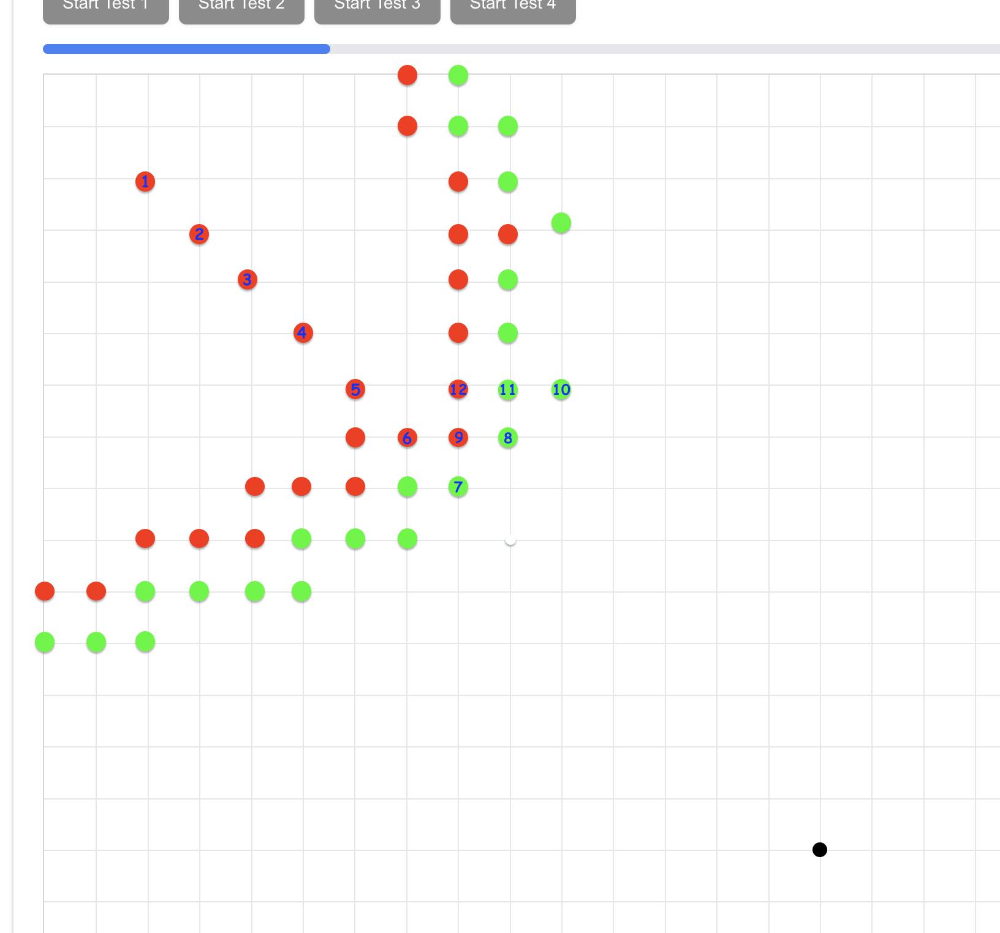

# Visual Field Test for Ocular Melanoma Patients

This webpage facilitates a modified [confrontation visual field test](https://en.wikipedia.org/wiki/Confrontation_visual_field_testing), 
primarily for tracking vision loss in patients post-[Ocular Brachytherapy](https://www.mskcc.org/cancer-care/patient-education/about-ocular-brachytherapy) for Ocular Melanoma. 
It helps monitor radiation-induced blindness progression while assessing the impact of treatments like TTT and Avastin. Additionally, it 
can aid in detecting peripheral vision loss linked to retinal or neurological issues.

## How It Works

* The test begins with a fixed focal point (black dot).
* A blinking secondary dot appears in different locations.
* The user presses space bar if they see the blinking dot within 5 seconds.
* Missed dots are marked red (blind spots), while detected ones are green.
* The focal point moves across four quadrants to capture a complete visual field map.

The final grid highlights potential vision loss, often forming a semi-circle or quadrant of red dots.

In the picture below, the numbers on some of the dots to give you an idea of the sequence these were displayed to the patient.

[]

## Getting Started

First, run the development server:

```bash
npm install

npm run start
```

Open [http://localhost:3000](http://localhost:3000) with your browser to see the result.
